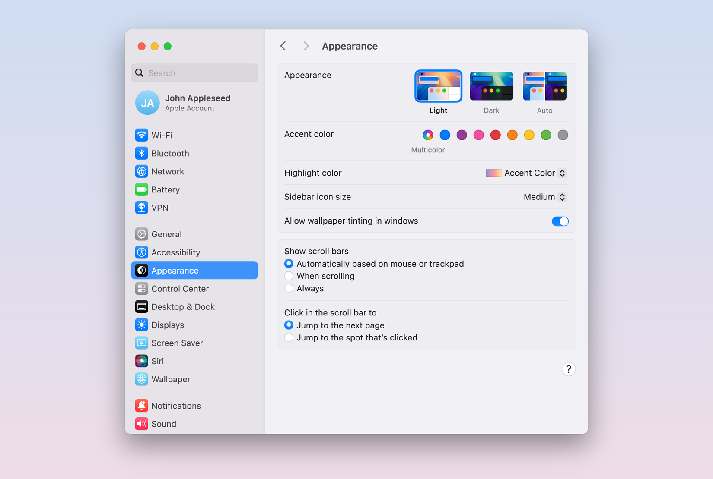
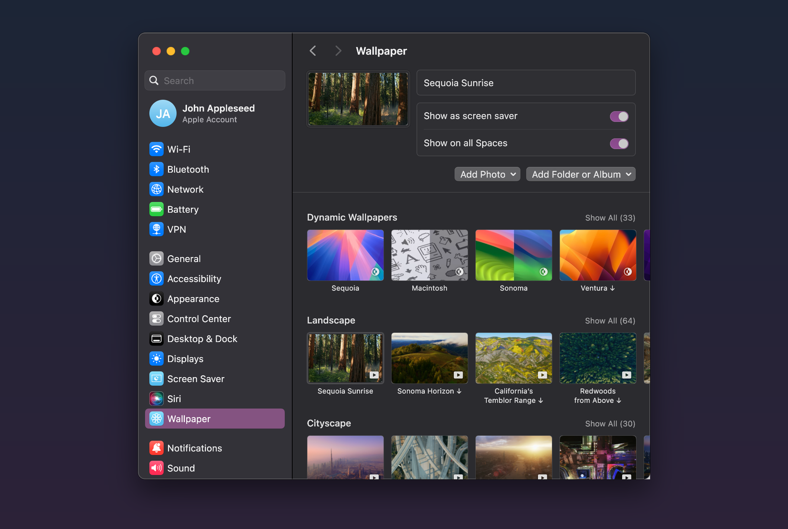
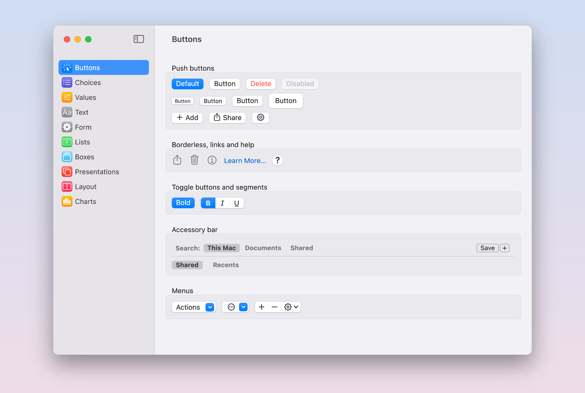
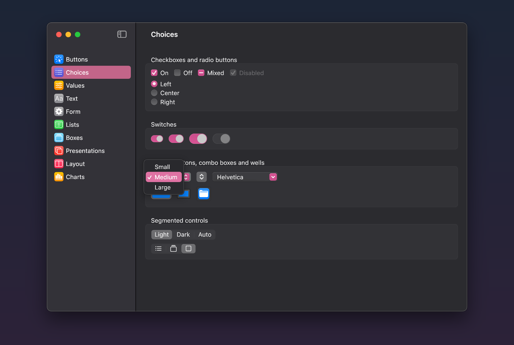
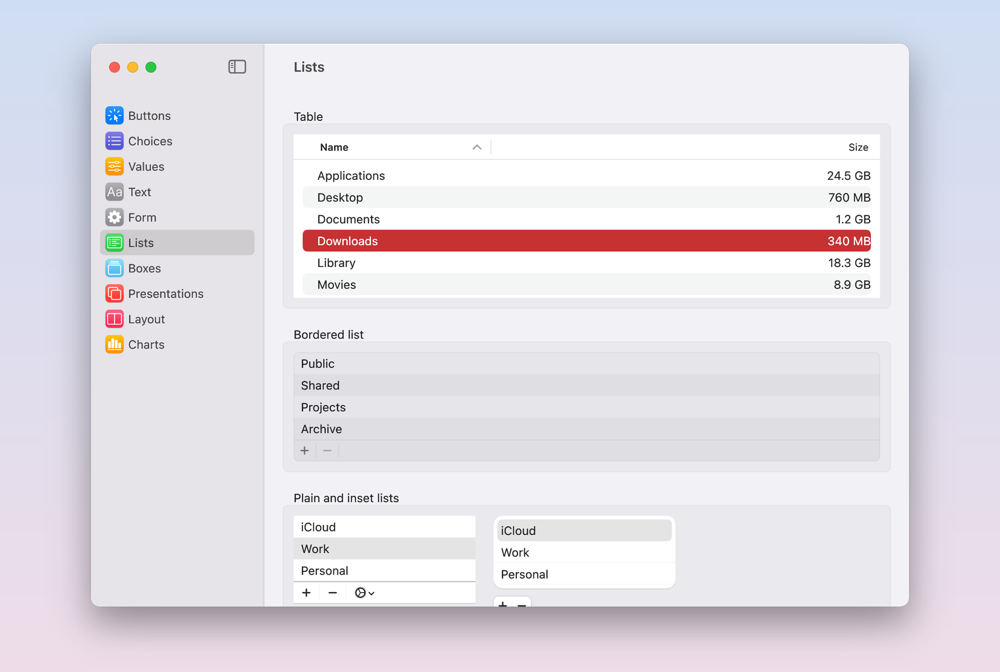
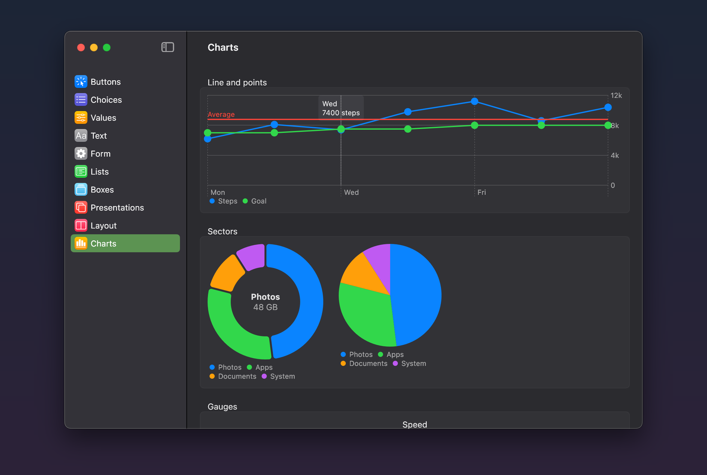
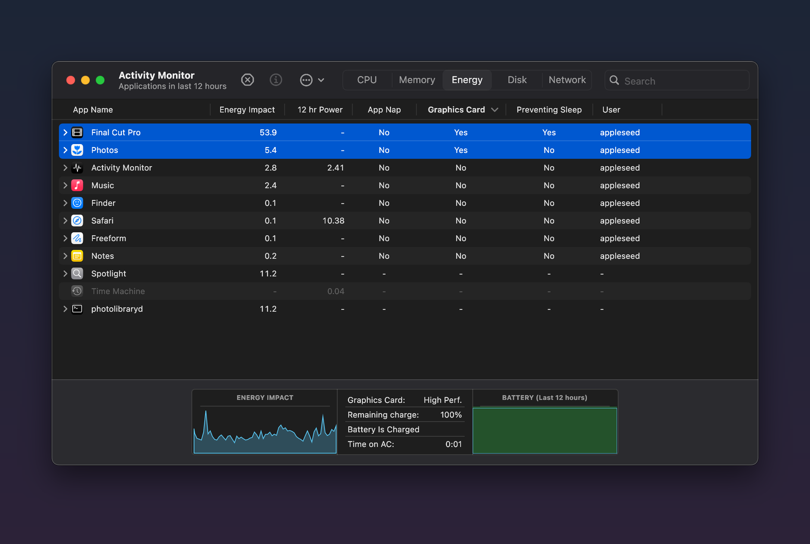
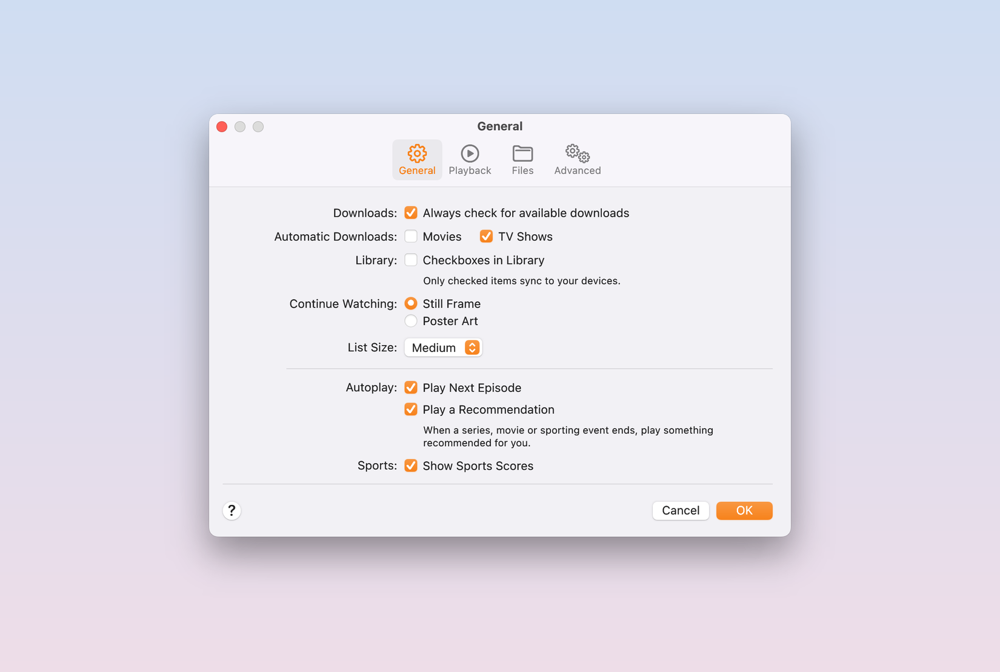
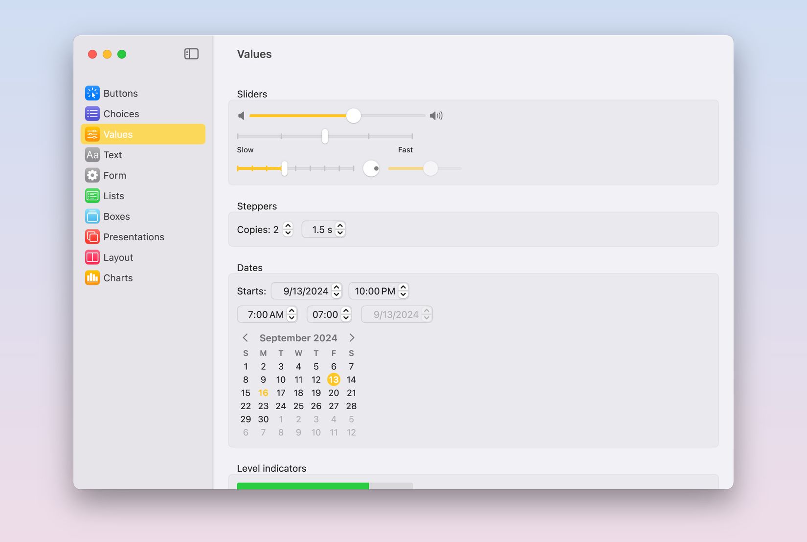
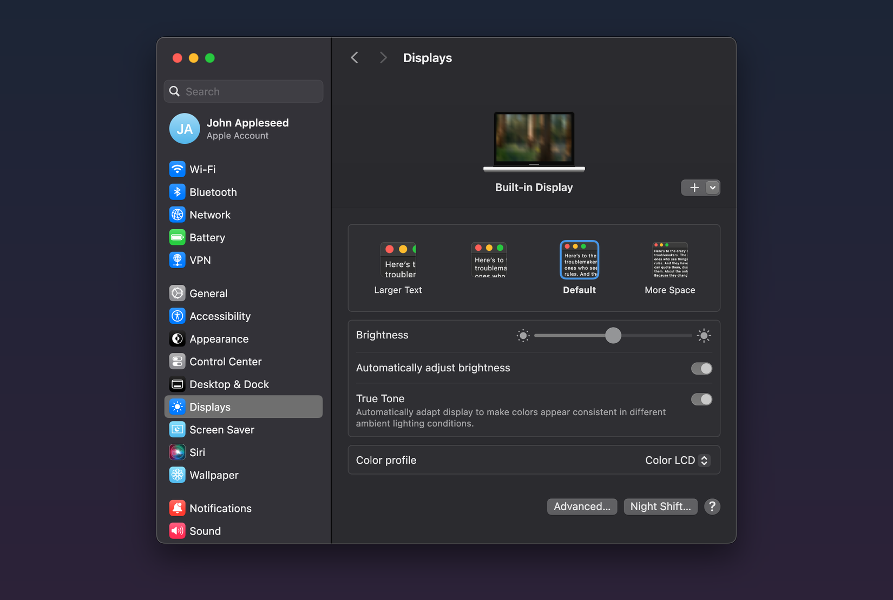

# imgui-apple

Apple style custom ImGui. macOS 15 Sequoia widgets for Dear ImGui with a SwiftUI style API

This is a widget lib that makes Dear ImGui look and feel like macOS Sequoia. Buttons switches popups sidebars tables sheets menus charts all of it. Everything is drawn with the plain ImGui draw list so no shaders no blur no platform API and it runs anywhere ImGui runs

The lib itself is called CupertinoUi and lives in the `Cupertino` namespace so thats what you include and link

Built on Dear ImGui 1.93.0 WIP, the `features/shadows` branch at commit [`332bf51`](https://github.com/ocornut/imgui/commit/332bf51ee9ba61a68f2c66124bf5342fb490104c). CMake pulls exactly that commit so you dont have to hunt for it

The API is SwiftUI style. Views are just functions and containers take a lambda with their content. State goes in by pointer where SwiftUI would take a binding. If you ever wrote SwiftUI you basically already know it

```cpp
Window("Preferences", nullptr, {.size = ImVec2(480, 300)}, [] {
    Form([] {
        Section({.header = "General"}, [] {
            Toggle("Notifications", &notifications);
            Picker("Quality", &quality, {"Low", "Medium", "High"});
            Slider("Volume", &volume, 0.0f, 1.0f);
        });
    });
});
```

## Review

Quick video tour of the showcase, click to watch it on YouTube

<p align="center">
  <a href="https://www.youtube.com/watch?v=Luj4DTKC62o"></a>
</p>

## Screenshots

<p align="center">
  
  
  
  
  
  
  
  
  
  
</p>

## What it copies

- macOS 15 Sequoia in light and dark with all 9 accent colors, wallpaper tinting and the inactive window look
- System Settings first cause thats where most of the controls live, plus Activity Monitor and a classic settings window with tabs as live examples
- Sizes colors and shadows come from Apple's macOS 15 Sequoia UI kit for Sketch, then every widget got checked against real @2x macOS 15 screenshots pixel by pixel. Where the kit and the real thing disagree the real thing wins
- Text is SF Pro SF Mono and SF Symbols with Apple's own tracking and kerning so it reads like the real deal
- Keyboard nav, focus rings, control sizes from mini to large and display scaling all work

## Components

Left side is what we copied, right side is what you call

| SwiftUI / AppKit | CupertinoUi |
|---|---|
| `Button` with its roles and bordered borderless link styles | `Button` |
| Help button | `HelpButton` |
| `Toggle` as switch and checkbox | `Toggle` |
| Toggle buttons and accessory bar buttons | `ButtonToggle` `AccessoryBarToggle` |
| `Picker` as menu radio group segmented and inline | `Picker` |
| Multi select segmented control | `SegmentedToggles` |
| `Menu` pull downs with submenus shortcuts badges and ⌥ items | `Menu` |
| `.contextMenu` | `ContextMenu` |
| `ControlGroup` | `ControlGroup` |
| `NSComboBox` | `ComboBox` |
| `Slider` plus the circular one | `Slider` |
| `Stepper` | `Stepper` |
| `DatePicker` as field and calendar | `DatePicker` |
| `ColorPicker` and the Colors window | `ColorPicker` `ColorPanel` |
| Image well | `ImageWell` |
| `TextField` `SecureField` | `TextField` `SecureField` |
| Search field with suggestions | `SearchField` |
| `TextEditor` | `TextEditor` |
| `NSTokenField` | `TokenField` |
| Shortcut recorder | `KeyRecorder` |
| `NSPathControl` | `PathControl` |
| `ProgressView` | `ProgressView` |
| `Gauge` | `Gauge` |
| `NSLevelIndicator` | `LevelIndicator` |
| `Text` `Image` `Label` `LabeledContent` | Same names |
| `Form` `Section` and `.formStyle(.columns)` | `Form` `Section` `ColumnsForm` |
| `NavigationLink` | `NavigationLink` |
| Sidebar `List` with groups search and account row | `List` `SidebarDisclosureGroup` `SidebarSearchField` `SidebarAccount` |
| `Table` with sorting resizable columns and outlines | `Table` |
| Bordered list with + and − | `BorderedList` |
| `DisclosureGroup` | `DisclosureGroup` |
| `GroupBox` `TabView` | `GroupBox` `TabView` |
| Finder style scope bar | `ScopeBar` |
| `ScrollView` | `ScrollView` |
| `VStack` `HStack` `ZStack` `Spacer` `Divider` | Same names |
| `.frame` `.padding` `.background` `.overlay` `.id` `Canvas` | `Frame` `Padding` `Background` `Overlay` `Id` `Canvas` |
| `Grid` `GridRow` `LazyVGrid` | Same names |
| `HSplitView` `VSplitView` | Same names |
| `NavigationSplitView` with collapsible sidebar and `.inspector` | `NavigationSplitView` |
| `Window` and `.windowStyle` | `Window` |
| `.toolbar` and settings window tabs | `Toolbar` `TabBar` |
| App menu bar | `MenuBar` |
| `.alert` `.confirmationDialog` | `Alert` `ConfirmationDialog` |
| `.sheet` | `Sheet` `SheetFooter` |
| `.popover` | `Popover` |
| `.help` tooltips | `Help` |
| Notification banners | `NotificationBanner` |
| `ContentUnavailableView` | `ContentUnavailableView` |
| Swift Charts bar area line point rule and sector marks | `BarChart` `AreaChart` `LineChart` `SectorChart` |
| `.disabled` `.controlSize` `.environment` | `Disabled` `WithControlSize` `WithEnvironment` |

## Not done yet

- The iOS 18 look. Started it then paused till macOS is fully done
- Three column `NavigationSplitView`, toolbar overflow and customizing, window tabs
- `.tint` on single views, search tokens, compact date picker, menu bar extras
- Drag and drop, VoiceOver, right to left text
- Blur and vibrancy are flat colors picked off screenshots. Liquid Glass from macOS 26 is not planned

## Build it

Just want to click around? Grab `imgui-apple-showcase.exe` from [Releases](https://github.com/MisterJerkins/imgui-apple/releases/latest) and run it, nothing to install

To build it yourself you need Windows 10 or 11, Visual Studio 2022 or newer with the Desktop development with C++ workload, CMake 3.25+ and git

```sh
git clone https://github.com/MisterJerkins/imgui-apple.git
cd imgui-apple
cmake -S . -B build
cmake --build build --config Release
build\bin\Release\showcase.exe
```

Or just open the folder in Visual Studio, pick `showcase.exe` as the startup item and hit F5

First configure pulls Dear ImGui from GitHub so you need internet once. The showcase opens full screen like a little mac desktop. View → Full Screen puts it in a window and the Apple menu has Quit

## Use it in your app

Drop the repo next to your project and link it

```cmake
add_subdirectory(imgui-apple EXCLUDE_FROM_ALL)
target_link_libraries(your_app PRIVATE CupertinoUi)
```

That also gives you the `imgui` target on the pinned commit, so use it instead of adding another copy of ImGui. Then call `Cupertino::Initialize({})` once after `ImGui::CreateContext()`, set `Cupertino::Environment()` every frame (appearance accent display scale) and call `Cupertino::EndFrame()` before `ImGui::Render()`. `showcase/main.cpp` is a full Win32 + DirectX 11 host in one file if you want to see it all wired up

Heads up: views get their identity from where they sit in the tree. If you swap pages with a switch (sidebar detail, tabs) wrap it in `Id(page, [&] { ... })` so every page gets its own scroll and layout and opens at the top, same as `.id()` in SwiftUI

Fonts and pictures are already baked into the build. If you use an SF Symbol the build doesnt have yet grab SF Pro and SF Mono from [developer.apple.com/fonts](https://developer.apple.com/fonts/), put the otf files in `reference/fonts`, `pip install fonttools` and run `python tools/bake.py`

## Whats where

```
src/CupertinoUi   the library, include Cupertino.h
examples          System Settings, Activity Monitor and the settings window with tabs
showcase          the showcase app
tools             bake.py for fonts and pictures, font tools
third_party       stb_image
```

## Credits

- [Dear ImGui](https://github.com/ocornut/imgui) by Omar Cornut, 1.93.0 WIP from the features/shadows branch
- [stb_image](https://github.com/nothings/stb) by Sean Barrett
- SF Pro, SF Mono and SF Symbols by Apple
- Apple's macOS 15 Sequoia UI kit for Sketch, the Human Interface Guidelines and the Swift Charts docs
- Tons of macOS 15 screenshots from 512 Pixels, Apple Support, MacStories, Ars Technica, Ask Different and more
- fontTools and uharfbuzz for the font tools

## License

MIT, see [LICENSE](LICENSE). It covers the code. The SF fonts, SF Symbols and macOS pictures baked into the `.inc` files belong to Apple and arent covered by it

Not affiliated with Apple in any way. Apple, macOS, SF Pro and SF Symbols are trademarks of Apple Inc.
